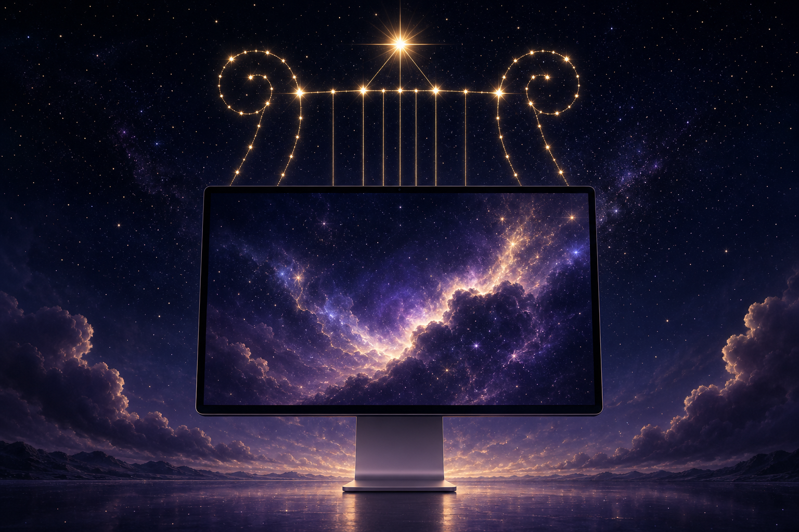

<h1 align="center">Lyra Screen Saver</h1>

<p align="center">
  
</p>

<p align="center">
  
  
  
  <a href="https://github.com/GeneralD/lyra"></a>
  
</p>

A macOS screen saver that plays [**lyra**](https://github.com/GeneralD/lyra)'s
video wallpaper — the same looping, cached video the lyra daemon draws on your
desktop, now on your lock and idle screens too. Lyrics and overlays are
intentionally left out; this is just the wallpaper.

## How it works

Rather than persist its own settings, the saver **reuses lyra's** (tracked as
[GeneralD/lyra#325], "plan B"). Earlier standalone video screen savers were
buggy precisely because `ScreenSaverDefaults` persistence is hard to get right,
so this one sidesteps it entirely:

- **Configuration** comes from lyra's own `~/.config/lyra/config.toml`
  `[wallpaper]` section — there is nothing to configure in the screen saver
  itself.
- **Video** is read from lyra's `~/.cache/lyra/wallpapers/` cache, which the
  daemon already downloads and maintains (local files, HTTP(S), and YouTube
  sources are resolved and cached by lyra).

Playback is driven by lyra's own `WallpaperPresenter`, imported through the
[`LyraKit`](https://github.com/GeneralD/lyra/blob/main/docs/LyraKit.md) library
product, so framing (aspect-fill, per-item zoom, cycle / shuffle advance) matches
the desktop wallpaper exactly.

## Requirements

- macOS 14+
- [**lyra**](https://github.com/GeneralD/lyra) installed and configured with at
  least one `[wallpaper]` entry (the saver plays whatever lyra is set to show)

## Install

### Homebrew (recommended)

```sh
brew install --cask GeneralD/tap/lyra-screensaver
```

The cask declares `depends_on formula: "generald/tap/lyra"`, so Homebrew pulls
in the lyra CLI as well. After installation, open **System Settings → Screen
Saver** and pick **LyraScreenSaver**.

### From source

Requires [XcodeGen](https://github.com/yonaskolb/XcodeGen)
(`brew install xcodegen`):

```sh
git clone https://github.com/GeneralD/lyra-screensaver.git
cd lyra-screensaver
make install          # generate → build → copy into ~/Library/Screen Savers
```

`make` targets: `generate`, `build`, `install`, `uninstall`, `clean`.

## Configuration

There is no separate screen-saver configuration. Point lyra at whatever you
want on screen:

```toml
# ~/.config/lyra/config.toml
[wallpaper]
# ... your wallpaper sources, trim, scale, cycle/shuffle ...
```

Every consumer of lyra's wallpaper — the desktop overlay and this screen saver —
picks up the same set.

## Architecture

```text
LyraScreenSaverView : ScreenSaverView   (this repo)
        │  imports
        ▼
     LyraKit  ──►  WallpaperPresenter  (AVPlayer loop / trim / cycle, NSWindow-free)
        │              │  onPlayerAvailable / onWallpaperScaleChange
        ▼              ▼
   lyra config    ~/.cache/lyra/wallpapers/
```

The whole integration is one view: it hosts an `AVPlayerLayer`, attaches the
presenter's stable `AVPlayer` once via `onPlayerAvailable`, and tracks per-item
zoom via `onWallpaperScaleChange` — mirroring lyra's own `AppWindow`. The Xcode
project is generated from [`project.yml`](project.yml) by XcodeGen and is not
checked in.

## Known limitations

- **Code signing / notarization is not yet wired.** CI ships an unsigned
  `.saver`, so Gatekeeper may block it on first load until signing +
  notarization are added. Tracked as follow-up work.
- **Sandbox access to lyra's cache is unverified.** The `legacyScreenSaver`
  host process is sandboxed; reading `~/.config/lyra` / `~/.cache/lyra` from it
  needs on-device confirmation (see [GeneralD/lyra#325]).

## License

[GPL-3.0](LICENSE), matching lyra.

## Related

- [**lyra**](https://github.com/GeneralD/lyra) — the desktop lyrics + video
  wallpaper app this saver reuses
- [GeneralD/lyra#325] — the tracking issue for this screen saver

[GeneralD/lyra#325]: https://github.com/GeneralD/lyra/issues/325
